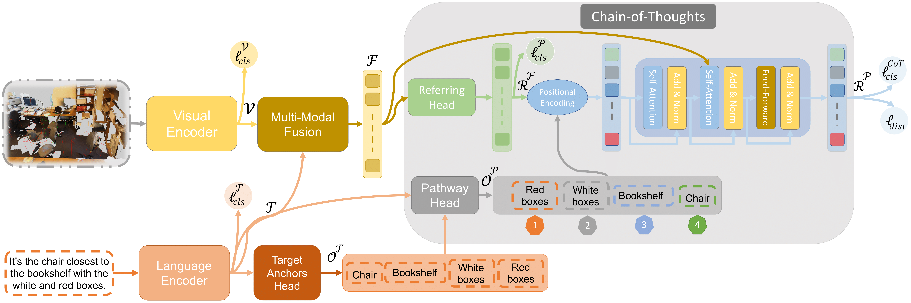

# CoT3DRef: Chain-of-Thoughts Data-Efficient 3D Visual Grounding
This is the official implementation for our paper

[**"CoT3DRef: Chain-of-Thoughts Data-Efficient 3D Visual Grounding"**]()

:satellite: []() &nbsp; &nbsp; &nbsp; &nbsp; &nbsp; &nbsp; &nbsp; &nbsp;
:book: []() &nbsp; &nbsp; &nbsp; &nbsp; &nbsp; &nbsp; &nbsp; &nbsp;

## :loudspeaker: News

## :books: Synopsis
<p align="center">
  
</p>
We aims to address the question of whether an interpretable 3D visual grounding framework, capable of emulating the human perception system, can be designed as shown in the figure above. 

<p align="center">
  
</p>

To achieve this objective, we formulate the 3D visual grounding problem as a sequence-to-sequence (Seq2Seq) task. As illustrated in the architecture above, the The input sequence comprises 3D objects from the scene and an utterance describing a specific object. In contrast to existing architectures, our model predicts both the target object and a chain of anchors on the output side.

## Model Zoo

### MVT-Nr3D:
| **Method-Data Percentage** | **10%** | **40%** | **70%** | **100%** |
|----------------------------|---------|---------|---------|----------|
| **MVT Baseline**           | 27.56   | 41.64   | 51.93   | 55.22    |
| **MVT + Pseudo Labels**    | 38.16   | 54.83   | 58.81   | 60.36    |
| **MVT + GT Labels**        | 37.23   | 53.89   | 62.95   | 64.36    |

### MVT-Sr3D:


## Installation and Data Preparation
Please refer the installation and data preparation from [referit3d](https://github.com/referit3d/referit3d).

We adopt bert-base-uncased from huggingface, which can be installed using pip as follows:
```Console
pip install transformers
```
you can download the pretrained weight in [this page](https://huggingface.co/bert-base-uncased/tree/main), and put them into a folder, noted as PATH_OF_BERT.

## Training 
* To train on Sr3d dataset, use the following command
```Console
python /CoT3D_VG/refering_codes/MVT-3DVG/train_referit3d.py \
   -scannet-file $PATH_OF_SCANNET_FILE$\
    -referit3D-file $PATH_OF_REFERIT3D_FILE$ \
    --bert-pretrain-path $PATH_OF_BERT$ \
    --log-dir logs/COT3DRef_sr3d \
    --n-workers 16 \
    --model 'referIt3DNet_transformer' \
    --unit-sphere-norm True \
    --batch-size 24 \
    --encoder-layer-num 3 \
    --decoder-layer-num 4 \
    --decoder-nhead-num 8 \
    --gpu "0" \
    --view_number 4 \
    --rotate_number 4 \
    --label-lang-sup True \
    --anchors "cot" \
    --max-test-objects 52 \
    --cot_type "cross" \
    --predict_lang_anchors True \
    --lang_filter_objs False \
    --visaug_shuffle_mode 'none' \
    --visaug_extracted_obj_path '$PATH_OF_SR3D_DATA' \
    --visaug_pc_augment True \
    --train_data_percent 1.0
```
* To train on NR3d dataset, just add the following commands:
```Console
    --shuffle_objects_percentage 0 \
    --visaug_pc_augment False \
    --train_data_percent 1.0 \
    --max_num_anchors 7 \
    --dropout-rate 0.15 \
    --textaug_paraphrase_percentage 0 \
    --target_aug_percentage 0 \
    --gaussian_latent False \
    --distractor_aux_loss_flag True \
    --train_data_repeatation 1 \
    --augment-with-sr3d '$PATH_OF_SR3D_DATA' 
```
* And Change the "--visaug_extracted_obj_path"
```Console
    --visaug_extracted_obj_path '$PATH_OF_NR3D_DATA' \
```

* To Train on Both SR3D and NR3d datasets, use the following command: 
```Console
python /CoT3D_VG/refering_codes/MVT-3DVG/train_referit3d.py \
   -scannet-file $PATH_OF_SCANNET_FILE$\
    -referit3D-file $PATH_OF_REFERIT3D_FILE$ \
    --bert-pretrain-path $PATH_OF_BERT$ \
    --log-dir logs/MVT_nr3d \
    --n-workers 16 \
    --model 'referIt3DNet_transformer' \
    --unit-sphere-norm True \
    --batch-size 64 \
    --encoder-layer-num 3 \
    --decoder-layer-num 4 \
    --decoder-nhead-num 8 \
    --gpu "0" \
    --view_number 4 \
    --rotate_number 4 \
    --label-lang-sup True \
    --anchors "cot" \
    --max-test-objects 52 \
    --cot_type "cross" \
    --predict_lang_anchors True \
    --lang_filter_objs False \
    --visaug_shuffle_mode 'none' \
    --shuffle_objects_percentage 0 \
    --visaug_extracted_obj_path '$PATH_OF_NR3D_DATA' \
    --visaug_pc_augment False \
    --train_data_percent 1.0 \
    --max_num_anchors 7 \
    --dropout-rate 0.15 \
    --textaug_paraphrase_percentage 0 \
    --target_aug_percentage 0 \
    --gaussian_latent False \
    --distractor_aux_loss_flag True \
    --train_data_repeatation 1 \
    --augment-with-sr3d '$PATH_OF_SR3D_DATA' 
```
## Validation
* After each epoch of the training, the program will automatically evaluate the performance of the current model. Our code will save the last model in the training as **last_model.pth**, and save the best model following the original Referit3D's repo as **best_model.pth**.


## Test
* At test time, the **analyze_predictions** will run following the original code of Referit3D. 
* The **analyze_predictions** will test the model multiple times, each time using a different random seed. With different random seeds, the sampled point clouds of each object are different. The average accuracy and std will be reported. 

* To test on either Nr3d or Sr3d dataset, use the following commands
```Console
    python referit3d/scripts/train_referit3d.py \
    --mode evaluate \
    -scannet-file $PATH_OF_SCANNET_FILE$ \
    -referit3D-file $PATH_OF_REFERIT3D_FILE$ \
    --bert-pretrain-path $PATH_OF_BERT$ \
    --log-dir logs/MVT_nr3d \
    --resume-path $the_path_to_the_model.pth$ \
    --n-workers 8 \
    --model 'referIt3DNet_transformer' \
    --unit-sphere-norm True \
    --batch-size 24 \
    --encoder-layer-num 3 \
    --decoder-layer-num 4 \
    --decoder-nhead-num 8 \
    --gpu "0" \
    --view_number 4 \
    --rotate_number 4 \
    --label-lang-sup True
```
* To test on joint trained model, add the following argument to the above command
```Console
    --augment-with-sr3d sr3d_dataset_file.csv
```


## :bouquet: Credits
The project is built based on the following repository:
* [ReferIt3D](https://github.com/referit3d/referit3d).
* [MVT-3DVG](https://github.com/sega-hsj/MVT-3DVG).

## :telephone: Contact us

## :mailbox_with_mail: Citation

```

```
# CoT3DRef
